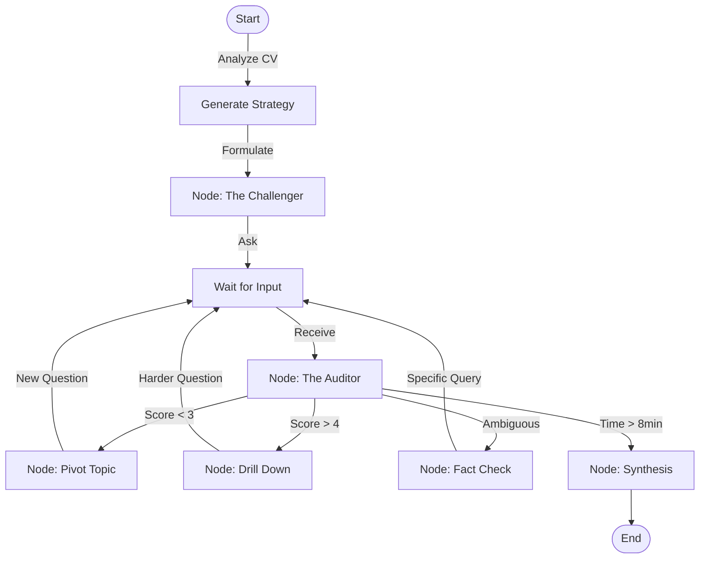

# The 10-Minute High-Signal Interview: Architecture Proposal

> **Constraint**: You have 10 minutes to validate an expert.
> **Goal**: Maximum Information Gain per Minute (IGPM).
> **Solution**: Adaptive, adversarial, graph-based interview flow.

This document outlines a proposed architecture to replace the linear "Question -> Answer -> Loop" with a state-aware, goal-seeking system using **LangGraph**.

## 1. The Core Philosophy: "Search vs. Sort"

In a standard 45-minute interview, you have time to "search" for a candidate's strengths. In a **10-minute constraint**, you do not have that luxury. You must "sort" them immediately based on their claimed expertise.

**The Current Problem**:
- Linear conversation flow is too polite and slow.
- "Tell me about yourself" wastes 2 minutes (20% of budget).
- Follow-up questions are often generic ("Can you explain more?").

**The New Strategy: "The Crucible Protocol"**
1.  **Zero Warm-up**: The AI enters the chat knowing the resume. The first question is a calibrated "Challenge Question" based on their strongest claim.
2.  **Depth-First Verification**: If they claim "Kubernetes Expert", we don't ask "What is a Pod?". We ask "How do you handle split-brain in an etcd cluster during a partition?"
3.  **Fail-Fast Pivoting**: If the first answer is weak (<3/5), we immediately pivot to a secondary skill. We don't coach; we verify.

---

## 2. Technical Architecture: Moving to LangGraph

The current `Brain` class is a monolithic loop. To implement "The Crucible Protocol", we need a **State Graph**.

We propose migrating the `Brain` logic to **LangChain / LangGraph**.

### 2.1 The Graph Structure

Instead of a simple while-loop, the interview becomes a graph of nodes:

### 2.2 The Nodes (Agents)

1.  **The Strategist (Setup Phase)**:
    *   **Input**: Resume, Job Description.
    *   **Action**: Identifies the *single most critical claim* on the CV.
    *   **Output**: An "Attack Plan" – a sequence of 3 topics to verify in order of risk.

2.  **The Challenger (Question Generator)**:
    *   **Role**: Generates questions that cannot be answered with generic knowledge.
    *   **Prompting**: "Ask a question that requires war stories to answer. Validates: 'Experience', not just 'Knowledge'."

3.  **The Auditor (Real-time Analyst)**:
    *   **Role**: The current `analyze_answer` function, but enhanced.
    *   **Task**: Calculates "Information Density". Does the answer contain unique entities (tools, metrics, specific outcomes)?
    *   **Decision**: 
        *   *Pass*: Move to next topic in Attack Plan.
        *   *Fail*: Mark topic as "Suspect", move to next.
        *   *Super-Pass*: Ask one "God-tier" question to see if they are top 1%.

---

## 3. Enhanced Scoring Methodology (Scoring 2.0)

To make a 10-minute decision, we need more than "1-5". We need probabilistic assessment.

### 3.1 Bayesian Expertise Tracking
We start with a "Belief Score" of 50% (Unknown).
*   Correct use of jargon + specific metric -> Belief **+15%**.
*   Vague answer ("We used best practices") -> Belief **-10%**.
*   Contradiction -> Belief **-30%**.

**The Final Score is a Confidence Interval**: "We are 90% confident this candidate is in the top 10% of engineers."

### 3.2 Key Metrics for 10-Minute High-Signal Evaluation

| Metric | Definition | Why it matters |
| :--- | :--- | :--- |
| **Time-to-Value (TTV)** | Seconds into the answer before the first "unique insight" is shared. | Experts get to the point. Amateurs ramble. |
| **Concrete Noun Ratio** | (Proper Nouns + Numbers) / Total Words. | Proxies for specific experience vs. theoretical fluff. |
| **Response Calibration** | Does the candidate say "I don't know" when appropriate? | Crucial for senior roles. Hallucination = Automatic Fail. |

### 3.3 The "Red Flag" Graph
We explicitly model "Red Flag" states.
*   *State: Defensiveness* (Candidate challenges the question validity without purpose).
*   *State: Evasion* (Candidate answers a different question).
*   If the graph enters a Red Flag state -> **Immediate Termination** capability (to save time).

---

## 4. Implementation Strategy (The "How")

### Phase 1: The LangGraph Runner
We wrap the existing `Brain` into a `LangGraphRunner`.
*   The `messages` list becomes the State.
*   The `interview_phase` (OPENING/QUESTIONS/CLOSING) becomes the Graph Nodes.

### Phase 2: The RAG Auditor
We equip the "Auditor" node with RAG access to the Candidate's own CV and a "Truth Database" of the domain.
*   *Candidate*: "I scaled Postgres to 10TB."
*   *Auditor (Internal Monologue)*: "Checking... 10TB on single master is unlikely without sharding. Querying follow-up: 'Did you shard? What key?'"

### Phase 3: Dynamic Time Management
The graph is time-aware.
*   `Node: Timer` runs in parallel.
*   @ 8:00 minutes: Injects a "Wrap-up" signal into the graph state.
*   The `Challenger` node forces the *last* question to be a "Synthesis" question ("What is your biggest lesson from that project?") to end on a high note.

## 5. Why LangChain/LangGraph?

1.  **State Management**: Handling "Context", "Time", "Strikes", and "Current Topic" in a single `State` object is cleaner than `Brain` class attributes.
2.  **Cyclic Capability**: We need loops. "Ask -> Clarify -> Ask Again". Linear chains cannot do this well.
3.  **Observability**: We can visualize *exactly* why the AI decided to pivot from Topic A to Topic B (using LangSmith traces).
4.  **Tool Use**: The AI can decide "I need to look up this library" before grading the answer.

## 6. Example Dialogue Flow (Graph Trace)

**[00:00] Node: Strategist**
*   *Input*: CV says "Lead Dev at FinTech".
*   *Plan*: 1. Concurrency (High Risk), 2. Regulatory Compliance (Context), 3. Team Leadership.

**[00:10] Node: Challenger (Topic 1)**
*   *AI*: "You mention high-frequency trading. How did you handle race conditions in the order matching engine specifically?" (Skipping "What is your role?")

**[02:00] Node: Auditor**
*   *User*: "We used Redis locks."
*   *Analysis*: Weak. Redis locks adds latency. Suspicious for HFT.
*   *Action*: Trigger `DeepDive`.

**[02:10] Node: DeepDive**
*   *AI*: "Redis locks introduce network RTT. Did that not kill your latency budget? How did you mitigate?"

**[09:00] Node: Synthesis**
*   *AI*: "We are out of time. One final question: If you built it again today, what would you change?"

**[10:00] Node: End**
*   *Verdict*: "Technically competent but architectural choices questionable for claimed scale. Score: 65/100."

---

*This architecture shifts the product from a 'Chatbot Interviewer' to an 'Autonomous Evaluation Agent'.*
