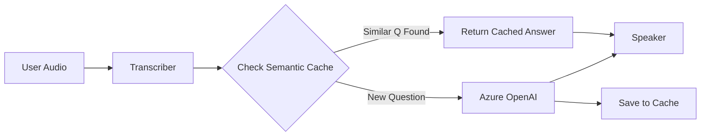

# Understanding Semantic Caching to Reduce AI Costs

You asked how **Semantic Caching** works and how it can reduce your AI usage (and costs) by up to 50%.

## 1. The Problem: Redundant Thinking
Currently, every time a user speaks to ExpertBridge, the system sends the text to Azure OpenAI (`gpt-4o`) to generate an answer.
*   **User A asks:** "Tell me about yourself." -> **$$$ (API Call)** -> AI answers.
*   **User B asks:** "Can you introduce yourself?" -> **$$$ (API Call)** -> AI answers.

Even though the questions mean the same thing, the AI generates a fresh answer every time, costing you money for every token.

## 2. The Solution: Semantic Caching
Semantic Caching introduces a "Memory Layer" before the AI.

Instead of checking if the text matches *exactly* (which almost never happens in speech), it checks if the **meaning** (semantics) is similar.

### How it Works (Step-by-Step)
1.  **Input**: User says "Tell me about yourself."
2.  **Vectorization**: The system converts this text into a "vector" (a list of numbers representing meaning, e.g., `[0.12, -0.98, 0.55...]`).
3.  **Search**: It looks in a local database (Milvus, Redis, Chroma) for any previous question with a similar vector (e.g., "Can you introduce yourself?").
4.  **Hit or Miss**:
    *   **Cache Hit**: If it finds a match (Similarity > 90%), it returns the *previous answer* instantly. **Cost: $0.**
    *   **Cache Miss**: If no match is found, it calls Azure OpenAI. **Cost: $$$**. The new Q&A pair is then saved to the cache.



## 3. Why it Reduces Costs by 50%
In interviews, many interactions are repetitive:
*   Greetings ("Hi, how are you?")
*   Standard clarifications ("Could you repeat that?")
*   Common technical definitions ("What is a class in Python?")

If 50% of your candidates ask similar questions or give similar short responses, you serve them from the cache for free.

## 4. How to Implement it in ExpertBridge

To add this to your current system, you would need to introduce a lightweight vector database.

### Recommended Tool: GPTCache
`GPTCache` is a Python library specifically designed for this.

**Installation:**
```bash
pip install gptcache
```

**Code Concept (in `brain.py`):**
```python
from gptcache import cache
from gptcache.adapter.openai import init_similarity_cache

# Initialize Cache (uses a local file for storage)
init_similarity_cache(cache_obj=cache, data_manager=manager)

# Use cached completion
response = cache.chat.completions.create(
    model="gpt-4o",
    messages=[...]
)
```

## 5. Trade-offs
*   **Pros**: Drastic cost reduction, faster response times (no LLM latency).
*   **Cons**:
    *   **storage**: You need to store the vectors (disk space).
    *   **Context**: In a long interview, the answer depends on *context* (what was said before). A simple cache might give a generic answer when a specific one is needed. You need to configure it to cache only "General Knowledge" questions, not personal ones.
